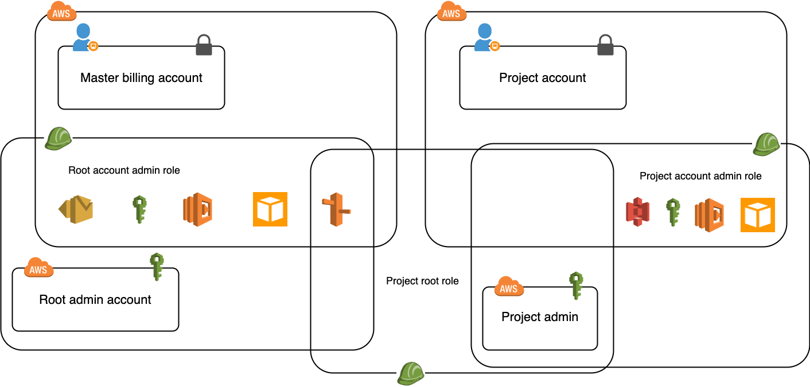

# AWS Accounts

We have the following users:

1. **Master billing account** (personal email address)
(Not used, ever! We have set up MFA on this account using a phone which is securely locked away after creating user #2).

2. **Admin for master billing account**
(Used very rarely, only when we need to configure settings in our master billing account (change iam permissions for instance) or add a new project).

```
Account alias: samhstn-root
IAM user name: root
```

3. **Project specific root account**
(Not used, only for initiating each new project admin).

(This user has an email of `aws+projectname@samhstn.com`).

4. **Project specific admin**
(Used frequently to view and update project infrastructure).

```
Account alias: projectname
IAM user name: admin

# E.g.
Account alias: samhstn
IAM user name: admin
```

View full list in [organization view](https://console.aws.amazon.com/organization) using Account #2.

From each Project specific admin, we can assume a role to configure a specific part of the master billing account or to configure services in our project account.


